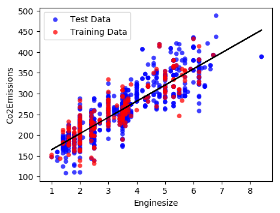

# Regression models for machine learning	
A set of functions for doing machine learning regression using sklearn, numpy, and pandas packages

## Instructions
* Functions can be used to conduct regression analysis and return fitting parameters as well as creating plots.

## To Do
* combine nonlinear ml with linear ml check that non-linear works will other functions.
* Build up functions to include more sophisticated machine learning algorithms.
* continue to improve documentation.

